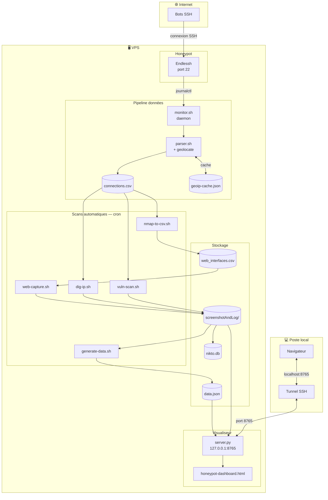

# Schéma du pipeline — Honeypot Monitor

```mermaid
flowchart TD
  subgraph NET["🌐 Internet"]
    BOT[Bots SSH]
  end

  subgraph VPS["🖥️ VPS"]
    subgraph TRAP["Honeypot"]
      END[Endlessh\nport 22]
    end

    subgraph PIPELINE["Pipeline données"]
      MON[monitor.sh\ndaemon]
      PAR[parser.sh\n+ geolocate]
      CSV[(connections.csv)]
      CACHE[(geoip-cache.json)]
    end

    subgraph SCANS["Scans automatiques — cron"]
      NMAP[nmap-to-csv.sh]
      CAP[web-capture.sh]
      DIG[dig-ip.sh]
      VULN[vuln-scan.sh]
      GEN[generate-data.sh]
    end

    subgraph STORE["Stockage"]
      WI[(web_interfaces.csv)]
      SCAN[(screenshotAndLog/)]
      DB[(nikto.db)]
      JSON[(data.json)]
    end

    subgraph VIZ["Visualiseur"]
      SRV[server.py\n127.0.0.1:8765]
      DASH[honeypot-dashboard.html]
    end
  end

  subgraph CLI["💻 Poste local"]
    SSH[Tunnel SSH]
    BROWSER[Navigateur]
  end

  BOT -->|connexion SSH| END
  END -->|journalctl| MON
  MON --> PAR
  PAR --> CSV
  PAR <-->|cache| CACHE
  CSV --> NMAP
  NMAP --> WI
  WI --> CAP
  CAP --> SCAN
  CSV --> DIG
  DIG --> SCAN
  CSV --> VULN
  VULN --> SCAN
  SCAN --> GEN
  GEN --> JSON
  SCAN --> DB
  JSON --> SRV
  SCAN --> SRV
  SRV --> DASH
  SSH <-->|port 8765| SRV
  BROWSER <-->|localhost:8765| SSH
```
