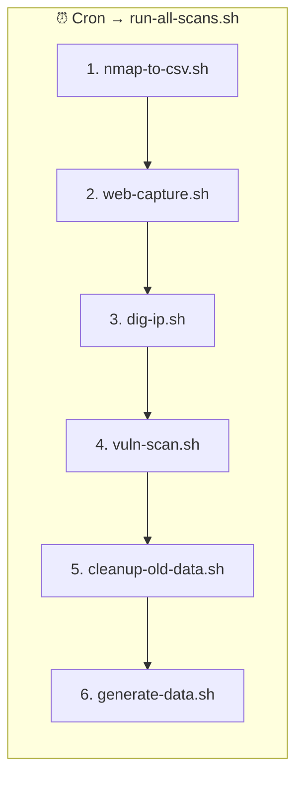
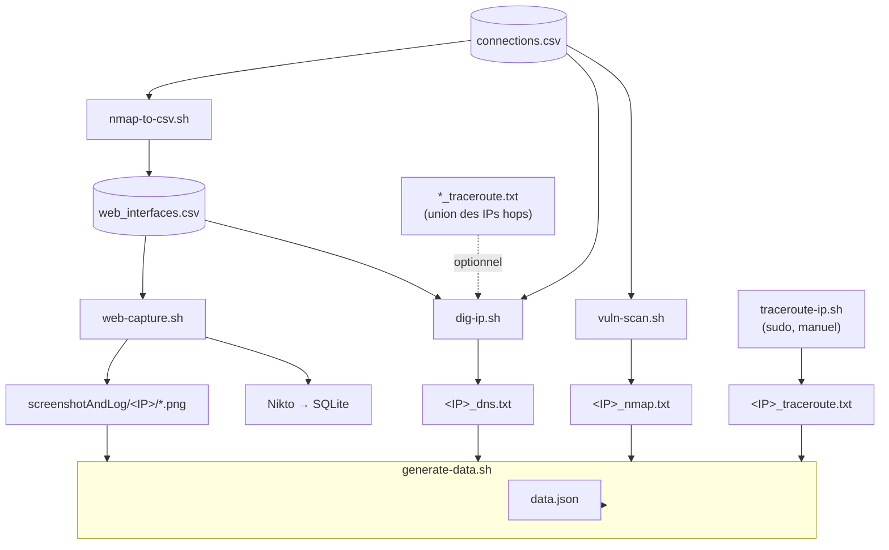
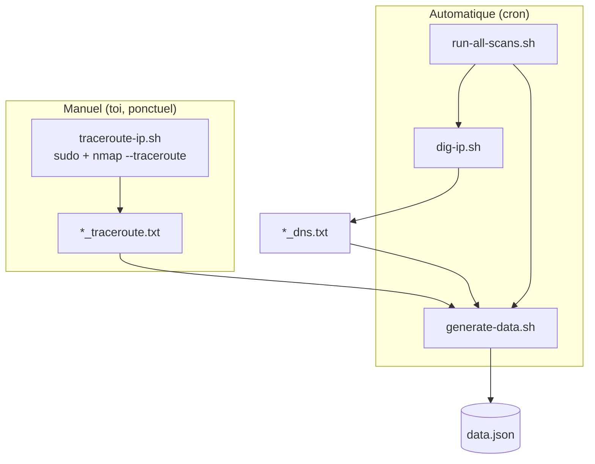
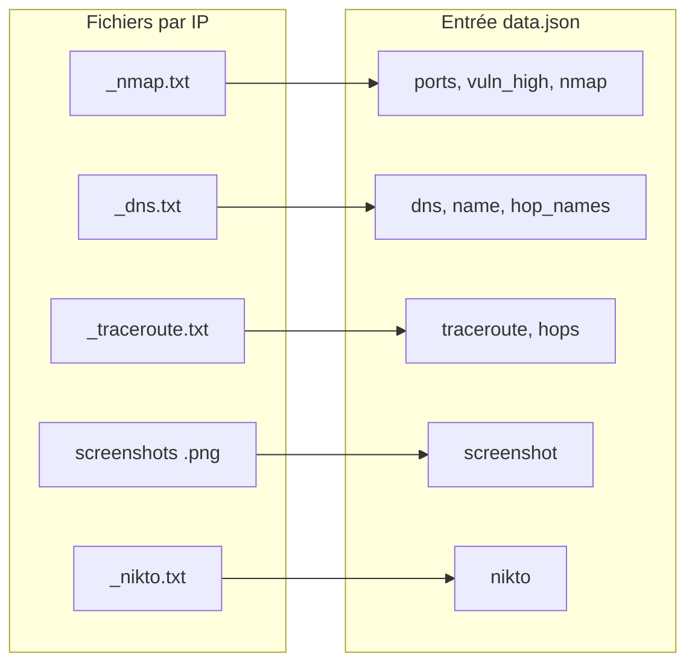
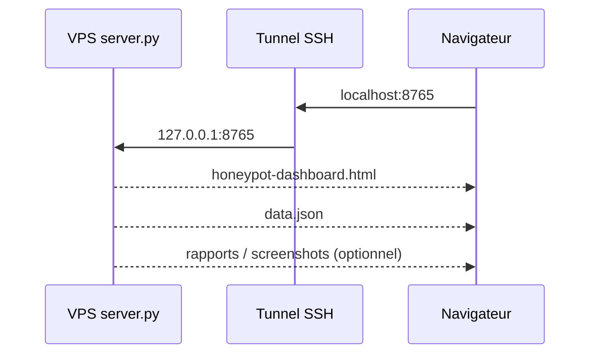
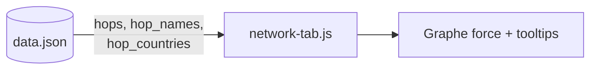

# Flux du projet — diagrammes Mermaid

Visualisation des enchaînements (cron, manuel, fichiers → `data.json`).  
À prévisualiser dans VS Code (extension Mermaid), GitHub, ou [mermaid.live](https://mermaid.live).

---

## 1. Ordre d’exécution — `run-all-scans.sh` (cron)

---

## 2. Vue « fichiers » : d’où viennent les rapports

> Note : le schéma simplifie les chemins ; tout part de `data/` selon `config`.

---

## 3. Traceroute & DNS : **hors cron** vs **cron**

---

## 4. Champs `data.json` ↔ fichiers (résumé)

---

## 5. Visualiseur web (tunnel)

---

## 6. Onglet Réseau (D3) — données consommées

---

*Pour le schéma global du pipeline, voir aussi `FLOWCHART.md`.*
